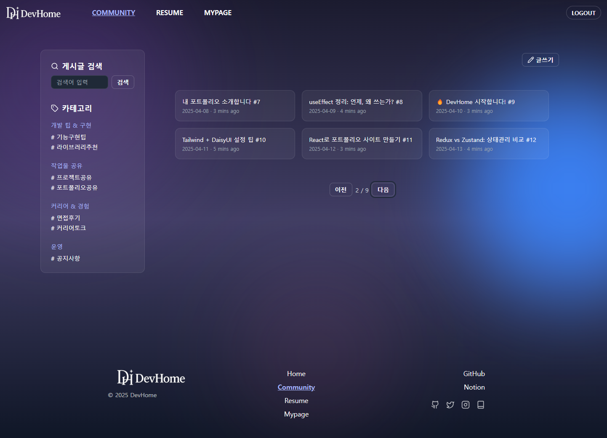
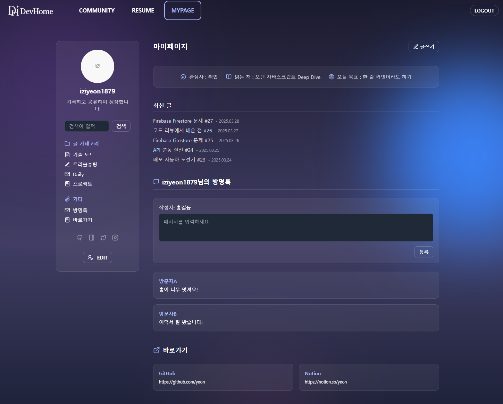
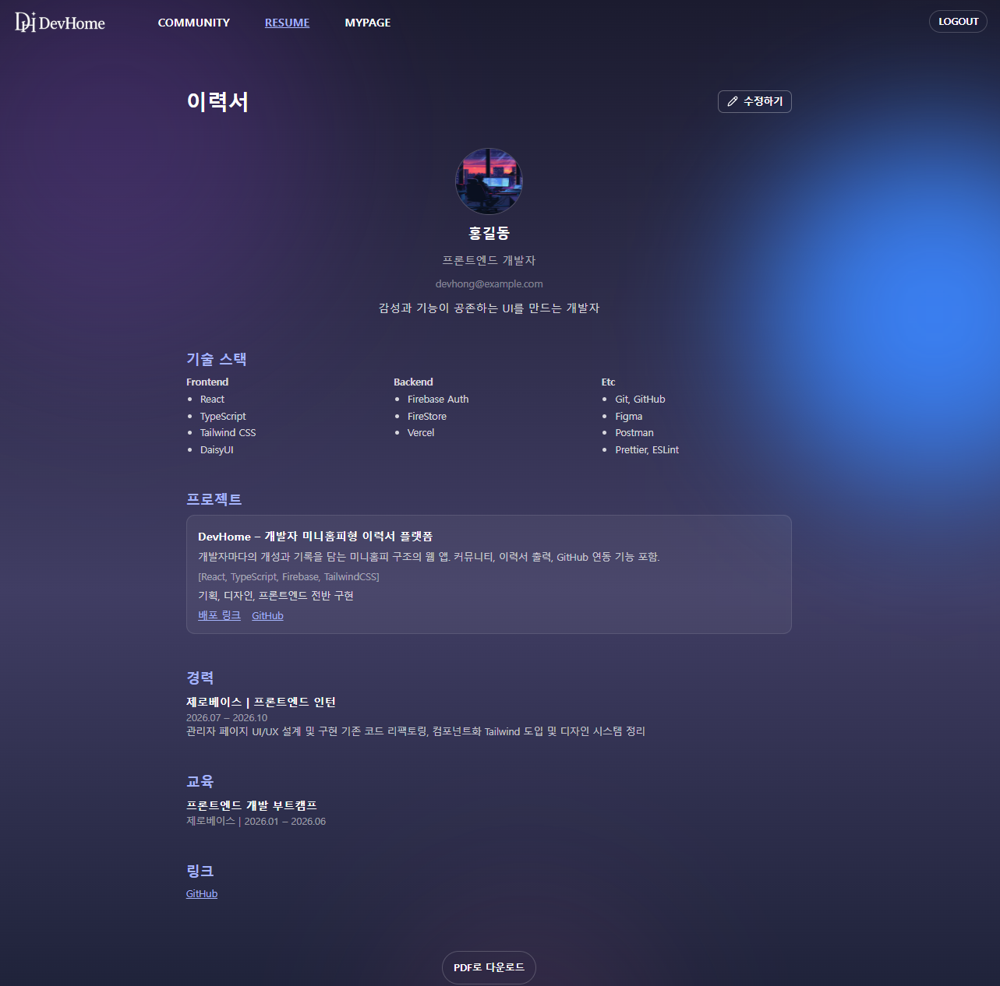

````markdown
# DevHome 🧭

개발자의 이력서와 커뮤니티가 하나로 연결되는 공간, DevHome
자신만의 홈페이지에서 이력서를 소개하고, 글을 쓰고,
방문자들과 방명록으로 소통하고, 커뮤니티에서 다양한 경험을 나눌 수 있습니다.

---

## 🔗 배포 링크

- [DevHome 바로가기](https://dev-home-eta.vercel.app/)

---

## 🖼 주요 화면

| 커뮤니티 메인                          | 마이페이지                          | 이력서 출력                         |
| -------------------------------------- | ----------------------------------- | ----------------------------------- |
|  |  |  |

---

## ✅ MVP 범위 (실제 구현 완료 기준)

| 분류           | 항목                                                                              | 설명                                                   |
| -------------- | --------------------------------------------------------------------------------- | ------------------------------------------------------ |
| 전체 페이지    | `/`, `/login`, `/signup`, `/community`, `/community/post/:id`, `/community/write` | 커뮤니티 메인, 글쓰기, 상세 페이지 구성                |
| 마이페이지     | `/mypage/:username`, `/mypage/:username/post/:id`, `/mypage/:username/write`      | 유저 전용 페이지 + 글 상세 및 작성                     |
| 카테고리 분류  | `/mypage/:username/category/:key`                                                 | 마이페이지 글 카테고리별 필터링                        |
| 검색 기능      | `/community/search`, `/mypage/:username/search`                                   | 제목/내용 기반 키워드 검색                             |
| 글 기능        | 작성 / 수정 / 삭제 / 목록 / 상세 / 카테고리 / 페이지네이션                        | 커뮤니티/마이페이지 공통, Firestore 기반               |
| 댓글 기능      | 커뮤니티 게시글 하단 댓글 작성/조회 가능                                          | 비로그인 시 읽기만 가능                                |
| 방명록 기능    | 마이페이지 내 방명록 탭에서 메시지 작성/열람                                      | 홈 주인에게 메시지 남기기                              |
| 프로필 기능    | 닉네임, 소개글, 직무, 프로필 이미지 업로드 가능                                   | `/settings/profile`에서 수정                           |
| 배너 설정      | 현재 관심사, 읽는 책, 오늘의 목표 등을 배너에 표시                                | 마이페이지 상단에 출력                                 |
| SNS / 링크     | GitHub, Notion, Blog 등 외부 링크 추가 가능                                       | 마이페이지 하단 또는 바로가기 탭에서 출력              |
| 이력서 기능    | 자기소개, 기술스택, 프로젝트, 커리어, PDF 출력 포함                               | `/resume`, `/resume/edit` 구현 완료 (`react-to-print`) |
| Firestore 연동 | 모든 게시글/유저정보/방명록/링크/이력서 정보 Firestore 기반 저장                  | Firestore 컬렉션 구조에 맞춰 설계 완료                 |
| 반응형 대응    | Tailwind 기반 모바일/태블릿 대응                                                  | Drawer, 그리드, 텍스트 크기 등 조정 완료               |
| 상태 관리      | 유저 상태 전역 관리, 유저 카테고리, 링크 등                                       | zustand 사용                                           |

---

## ⏳ 추후 예정 기능

| 분류            | 항목                                  | 설명                             |
| --------------- | ------------------------------------- | -------------------------------- |
| 홈 커스터마이징 | 테마 컬러, 배경 이미지 등 개인화 설정 | 미니홈피 스타일 강화             |
| 다크모드        | 라이트/다크 모드 전환                 | Tailwind dark: + localStorage    |
| 좋아요 기능     | 게시글 좋아요/취소                    | 로그인 사용자 한정               |
| 신고 기능       | 댓글/방명록 신고 처리                 | `/admin/report` 연동 예정        |
| 비공개 글       | 나만 보기 설정                        | `isPrivate: true` 필드 사용 예정 |
| 알림 기능       | 댓글/방명록 작성 시 알림              | Firebase Messaging 또는 UI 알림  |
| 블로그 기능     | 글 시리즈화, 마크다운 지원            | `/blog` 내 탭 구성 예정          |
| 통계 기능       | 방문수 / 좋아요 수 / 작성글 수 등     | `/dashboard` 기반 시각화 예정    |
| SEO / 공유      | meta 태그 / og 태그 / 공유 버튼       | 퍼블릭 노출 최적화               |
| PWA 대응        | 앱 설치 지원                          | manifest + 오프라인 대응 예정    |

---

## 🛠 주요 기술 스택 및 버전

| 구분          | 기술 / 도구                          | 버전             |
| ------------- | ------------------------------------ | ---------------- |
| 프레임워크    | React                                | `18.2.0`         |
| 언어          | TypeScript                           | `5.3.3`          |
| 번들러        | Vite                                 | `4.4.9`          |
| 라우팅        | React Router DOM                     | `6.23.0`         |
| 상태관리      | Zustand                              | `4.4.7`          |
| 스타일링      | Tailwind CSS                         | `3.4.1`          |
| UI 컴포넌트   | DaisyUI                              | `4.4.24`         |
| 아이콘        | lucide-react                         | `0.292.0`        |
| 인증/DB       | Firebase SDK (Auth, Firestore)       | `10.7.1`         |
| PDF 출력      | react-to-print                       | `2.14.13`        |
| 기타 유틸리티 | html2pdf.js, classnames, date-fns 등 | 프로젝트 내 사용 |

---

## ⚙ 개발 환경 설정 방법

```bash
git clone https://github.com/iziyeon/DevHome.git
cd devhome
npm install
npm run dev
```
````

### 📁 DevHome 폴더 구조

```
📦 devhome/
├── .env                    # Firebase 환경변수
├── index.html              # 진입 HTML
├── README.md               # 프로젝트 문서
├── package.json            # 의존성 정의
├── tailwind.config.js      # Tailwind 설정
├── vite.config.ts          # Vite 빌드 설정
├── tsconfig.json           # TypeScript 설정
├── src/                    # 소스 디렉토리
│   ├── App.tsx             # 최상위 앱 컴포넌트
│   ├── main.tsx            # 앱 진입 파일
│   ├── firebase.ts         # Firebase 초기화
│   ├── index.css           # 전역 스타일
│   ├── assets/             # 이미지, 배경 등 정적 리소스
│   │   └── layout/         # 배경, 로고, 기본 이미지
│   ├── components/         # 재사용 및 페이지별 UI 컴포넌트
│   │   ├── common/         # 버튼, 입력창 등 공통 요소
│   │   ├── layout/         # Header, Footer, PageWrapper
│   │   ├── pages/          # 페이지별 UI 모듈 (커뮤니티, 마이페이지 등)
│   ├── contexts/           # 전역 Context API (Auth 등)
│   ├── data/               # 더미 데이터, 샘플 정보
│   ├── hooks/              # 커스텀 훅 모음
│   ├── pages/              # 페이지 라우트와 연결되는 파일
│   ├── routes/             # react-router 설정
│   ├── services/           # Firestore 등 API 연동
│   │   └── firestore/      # 게시글/유저 저장 관련 함수
│   ├── stores/             # zustand 상태 저장소
│   └── types/              # 전역 타입 선언 (resumeTypes 등)
```

### 🌿 브랜치 전략

| 브랜치 패턴  | 용도 설명                                 |
| ------------ | ----------------------------------------- |
| `main`       | 최종 배포용 브랜치                        |
| `develop`    | 기본 개발 브랜치 (Vercel 배포 연결)       |
| `feature/*`  | 기능 단위 개발 (예: `feature/post-write`) |
| `fix/*`      | 버그 수정 브랜치                          |
| `refactor/*` | 구조 개선, 리팩토링 전용 브랜치           |
| `doc/*`      | 문서/기획서/README 관련 작업 브랜치       |

### 📌 주요 스크립트

| 명령어           | 설명                   |
| ---------------- | ---------------------- |
| `npm run dev`    | 개발 서버 실행         |
| `npm run build`  | 프로젝트 빌드          |
| `npm run lint`   | ESLint 실행            |
| `npm run format` | Prettier로 코드 포맷팅 |

### 🪜 커밋 전략

| 태그       | 설명                                |
| ---------- | ----------------------------------- |
| `feat`     | 새로운 기능 추가                    |
| `fix`      | 버그 수정                           |
| `refactor` | 기능 변경 없이 코드 구조 개선       |
| `style`    | 포맷, 세미콜론 등 UI/스타일 변경    |
| `docs`     | 문서 변경 (README 등)               |
| `chore`    | 빌드 설정, 패키지 수정 등 기타 변경 |
| `test`     | 테스트 코드 추가/수정               |

예시:

```
feat: 마이페이지 글쓰기 기능 구현
fix: 커뮤니티 검색 시 카테고리 초기화 문제 해결
refactor: sidebar 구조 컴포넌트 분리
```

### 👤 개발자

| 이름 | GitHub                                | Email                 |
| ---- | ------------------------------------- | --------------------- |
| YEON | [iziyeon](https://github.com/iziyeon) | dlfvkfclfrn@gmail.com |

### 📄 라이선스

MIT License © 2025 YEON

```

```
